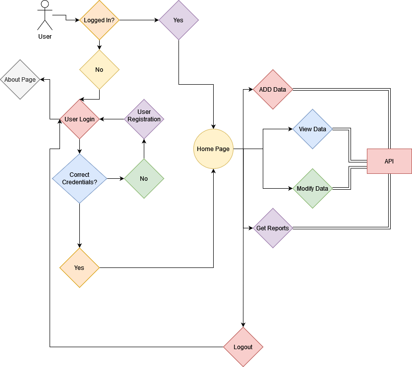

# Inventory Management System Backend Documentation

Welcome to the backend documentation for the **World of Jars** Inventory Management System! This guide provides detailed insights into the setup, architecture, and functionalities of the backend server, including information on API endpoints, database configurations, and security practices.

## Table of Contents

- [Overview](#overview)
- [Getting Started](#getting-started)
  - [Prerequisites](#prerequisites)
  - [Installation](#installation)
  - [Running the Server](#running-the-server)
- [API Endpoints](#api-endpoints)
  - [User Management](#user-management)
  - [Inventory Management](#inventory-management)
  - [Location and Status Management](#location-and-status-management)
- [Database Configuration](#database-configuration)
- [Security and Authentication](#security-and-authentication)
- [Error Handling](#error-handling)
- [Contributing](#contributing)

## Overview

The backend of the World of Jars Inventory Management System is built with Node.js, Express.js for the server, and PostgreSQL for the database. It provides RESTful API endpoints for managing users, jar inventory items, locations, and statuses, ensuring seamless and secure inventory management operations.

## Getting Started

### Prerequisites

- Node.js (v14 or newer)
- npm (v6 or newer)
- PostgreSQL (v12 or newer)

### Installation

Clone the repository and install dependencies:

git clone https://example.com/world-of-jars-backend.git
cd world-of-jars-backend
npm install

# Running the Server

Start the server locally:

npm start

## API Endpoints

### User Management

- `POST /register` - Register a new user.
- `POST /login` - Authenticate a user and return a JWT.
- `PUT /users/:id` - Update user information.
- `DELETE /users/:id` - Delete a user.

### Inventory Management

- `GET /` - Retrieve all inventory items.
- `POST /` - Add a new jar to the inventory.
- `PUT /` - Update an existing inventory item.
- `DELETE /:id` - Remove an inventory item.

### Location and Status Management

- `GET /locations` - Fetch all locations.
- `POST /locations` - Add a new location.
- `PUT /locations/:id` - Update a location.
- `DELETE /locations/:id` - Delete a location.

## Database Configuration

The system uses PostgreSQL. Ensure you have a `.env` file with your database configuration, or set up your environment variables for database connectivity.

## Security and Authentication

JWT is used for securing endpoints. Ensure the `JWT_SECRET` environment variable is set for token generation and verification.

## Error Handling

Standard HTTP status codes are used to indicate the success or failure of API requests. Proper error handling is implemented to ensure clear, descriptive messages are returned for troubleshooting.

## Contributing

We welcome contributions! Please follow the GitHub Flow. Fork the repository, make your changes, and submit a pull request.

- Ensure your code follows the existing style to maintain the project's consistency.
- Write tests for new functionalities and fix any issues your changes may introduce.
- Update the documentation accordingly.

For major changes, please open an issue first to discuss what you would like to change.

